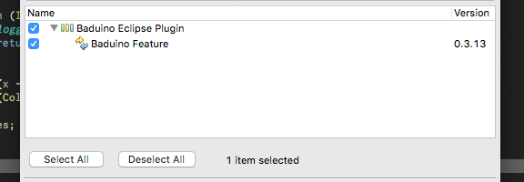

# Baduino Eclipse Plugin
Bitwise-Algorithm Definition-Use assocIatioN visualizatiOn

* [Instalação](#instalação)
* [Requisitos](#requisitos)
* [Exemplo](#exemplo)

### O que é?
Baduino é um Plugin do Eclipse para visualização de cobertura de critério de testes baseado em fluxo de dados intraprocedimental, ou seja, exibe as associações definição-uso cobertas em cada método do projeto.

Associaçoes definição-uso (DUA) definem uma relação entre a definição de uma váriavel e o seu subsequente uso.

### Por quê?
A análise de cobertura de critérios baseado em fluxo de dados é muito custosa, em parte devido ao alto custo de rastrear as DUAs em tempo de execução. Por isso, dificilmente são usadas na prática.

Para tornar a análise de cobertura de critérios baseado em fluxo de dados escalável para programas reais, a Baduino utiliza a estratégia para cálculo de cobertura de fluxo de dados [Bitwise-Algorithm](http://www.sciencedirect.com/science/article/pii/S0020019013000537).

### Como?
A cobertura é gerada executando os testes com um JUnit Runner. Esse Runner roda os testes com a ferramenta [BA-DUA](https://github.com/saeg/ba-dua) como agente. A Ba-dua (Bitwise Algorithm-powered Definition-Use Association) é a ferramenta que implementa o cálculo de cobertura de DUAs.

O resultado da cobertura obtida é apresentado no Eclipse pela Baduino.

## Instalação

1. No menu do Eclipse, selecione *Help → Install New Software...*

2. Na janela *Install*, no campo *Work with*, digite `https://saeg.github.io/update-site`

3. Selecione a última versão da Baduino e clique em *Next*

4. Siga os passos do instalador.                        

## Requisitos
* Java 1.8
* Classes de teste com o sufixo *Test.class

Apesar de ter sido criada utilizando maven, a Baduino não requer que o projeto a ser analizado esteja nessa estrutura, pois ela vasculha o projeto e encontra todas as classes compiladas.

Para uma melhor performance na busca pelas classes, a Baduino usa a nova API Stream do Java, sendo necessária a versão 1.8 ou superior. Com isso, a Baduino é capaz de analisar qualquer projeto em qualquer estrutura, dispensando configurações complicadas.

É só clicar, executar os testes e visualizar os resultados. Simples.

## Exemplo

A classe Max contém um método que recebe como entrada dois parâmetros (um vetor de inteiros e um inteiro com o tamanho do vetor) e retorna o maior valor dentro daquele vetor.

#### Código fonte

O caso de teste a seguir foi feito usando **JUnit** e verifica se o retorno de `max([1,2], 2)` é 2.

#### Classe de teste

Para conseguir a cobertura de DUAs é necessário executar os testes com o **JUnit**. Isso requer a criação de uma nova **JVM (Java Virtual Machine)** com o classpath do projeto em questão e com a BA-DUA como **JavaAgent**, de forma a instrumentar as classes utilizadas pelos testes e coletar a cobertura de DUAs.

A **BA-DUA**, responsável pela instrumentação das classes, também se encarrega de guardar os dados de cobertura após a finalização dos testes, salvando a cobertura em um arquivo chamado **coverage.xml** na pasta **.baduino/** localizada na raíz do projeto.

Após ter a cobertura no XML, o plugin se encarrega de exibir as DUAs em sua visualização.

Todo esse processo é realizado clicando com o botão direito no *Projeto → Baduino → Run Tests*.

Para visualizar as DUAs, é só clicar com o botão direito no *projeto/pacote/classe → Project/Package/Class Visualization*.

> A visualização é feita hierarquicamente.
> Clicando em **Project Visualization** será exibido a cobertura de DUAs de todo o projeto, e assim por diante.

#### Visualização do plugin

Na visualização é possível clicar nas DUA e as linhas da **Definição** e do **Uso** serão pintadas no código fonte como mostram as figuras abaixo. DUAs cobertas e não cobertas serão pintadas de **verde** e **vermelho**, respectivamente.

Também é possível remover todas as DUAs pintadas, clicando no  **Remove Highlight** no canto superior direito da View.

#### DUA coberta

#### DUA não coberta

